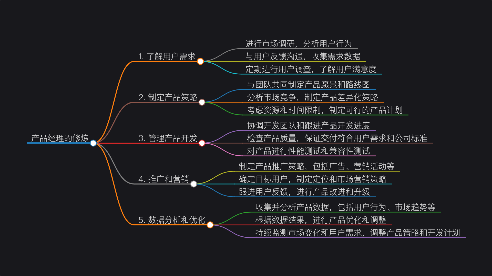
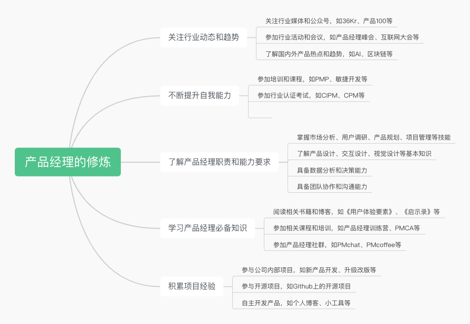

## PPT生成

### 一、告诉GPT你要生成的内容主题和格式。

问：
```
请帮我制作一个以 《AI 人工智能的发展历程》为主题的PPT文档，请遵循以下规则:
1、需要有封面页，包括副标题
2、有内容大纲页
3、总共至少6页
4、切记必须以markdown代码块输出
```

答：
```markdown
非常抱歉，AI机器人并没有制作PPT文件的能力。不过，我可以提供一个Markdown版本的文档，您可以按照PPT的格式和样式进行排版。

# AI 人工智能的发展历程

## 副标题：从机械计算到深度学习

### 内容大纲

1. 机械计算和逻辑推理
2. 人工智能的夏天
3. 人工神经网络和深度学习
4. 智能应用和人工通用智能
5. 未来展望和风险

### 机械计算和逻辑推理

- 图灵提出机器可以思考的概念
- 二十世纪五六十年代，开始使用逻辑理论进行推理
- 逻辑和符号计算的局限性导致推理失败

### 人工智能的夏天

- 1980年代，AI成为热门话题
- 专家系统和知识表示的开发
- 基于规则的AI在语音识别、图像处理等方面取得一定进展

### 人工神经网络和深度学习

- 引入神经科学中的概念和方法
- 卷积神经网络、循环神经网络、生成对抗网络等不断涌现
- 深度学习在图像识别、语音识别、自然语言处理等领域取得突破

### 智能应用和人工通用智能

- AI技术开始在各个领域得到应用
- 面向任务的人工智能和通用人工智能的发展
- 机器学习自动化和强化学习等技术的兴起

### 未来展望和风险

- AI技术的前景和挑战
- 人工智能对就业、隐私和安全等问题的影响
- 发展AI的重要性和需要注意的风险

### 结束语

- AI的发展历程体现了科技变革的速度和影响力
- 未来AI将不断攀升，为人类带来更多惊喜和挑战

以上是一个简单的Markdown版本的文档，供您参考。如果您想将其转换为PPT，可以使用在线工具或者专业软件进行排版和美化。

```

### 二、复制markdown，通过MindShow网站制作PPT

1. 点击 ChatGPT 中的 copy code将输出结果拷贝出来，将不相干的描述内容删除。
2. 打开 [MindShow](mindshow.fun) 网站，选择"我的文档"，点击导入，选择 Markdown 格式，然后把拷贝的内容复制到下面的输入框中，最后点击"导入创建"。
3. 进入到 PPT 的预览编辑页，自行修改左侧的封面相关内容，然后右侧可点击模版和布局选择具体的样式，其中有免费和 VIP 的。最后可点击右上角的"演示"按钮全屏查看效果，如果觉得OK，直接点击下载，如果有问题，可返回重新选择合适的模版和布局。

**或者利用[gamma](https://gamma.app/generate) 一键生成PDF，再使用工具转换PPT。**

## Excel处理表格

## 思维导图

### ChatMind
**网站地址：**[https://www.chatmind.tech/](https://www.chatmind.tech/)

**例子：**


**功能特点：**
1. 支持种类比较多，有``AI脑图``、``AI表格``、``AI写作``、``聊天``
2. AI脑图将思维导图的功能做了抽象，比如标签可以随意加减，默认有：高质量、详细、多层级、多分支、清晰
3. 支持编辑markdown原始文件和其他优化修改操作
4. 支持下载成``图片``、``svg``、``markdown``、``高清图片``
5. 支持免费版、VIP版本，免费版本也够用了。


### ProcessON
**网站地址：**[https://www.processon.com/](https://www.processon.com/)

**例子：**


**功能特点：**
1. 功能丰富、支持流程图、思维导图，有成熟的模板和社区
2. 生成的思维导图可以直接编辑，所见即所得
3. 下载功能支持多种格式，``图片``、``XMind``、``FreeMind``、``Word``、``Excel``、``PPT``、``高清PDF``、``SVG``、``高清图片``
4. 必须成为vip，也不贵，一年159，永久998

## 表格生成
